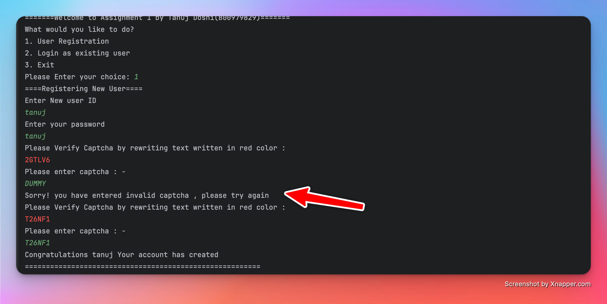
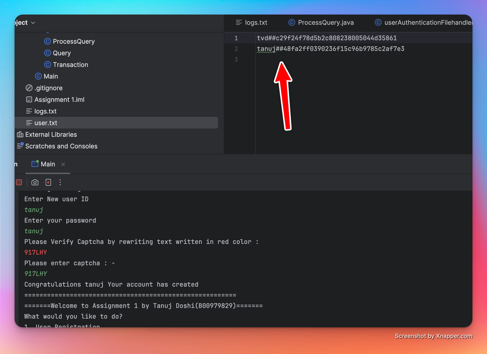
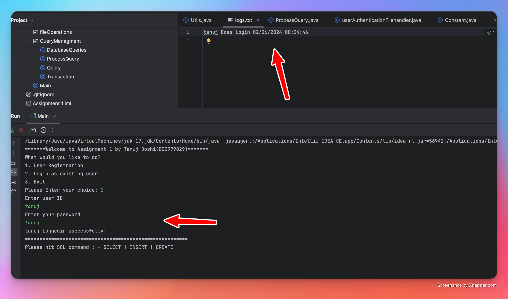
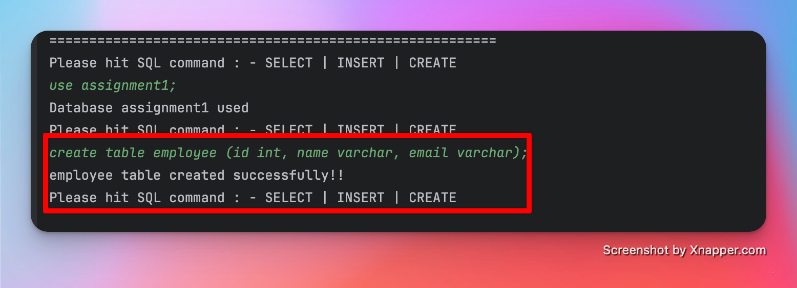
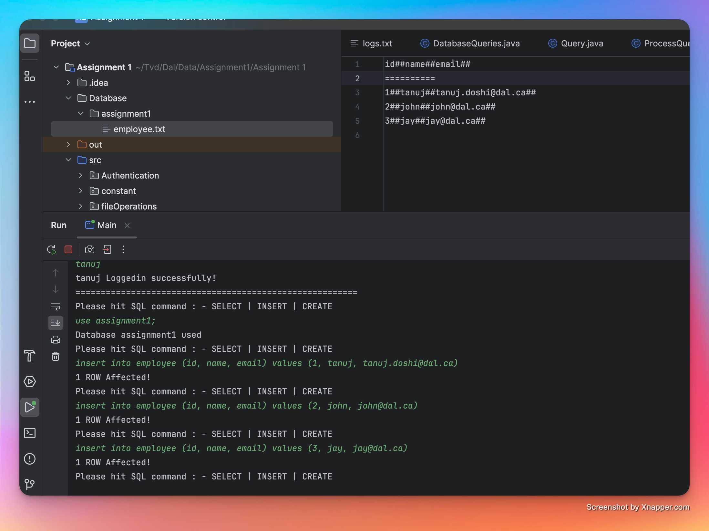
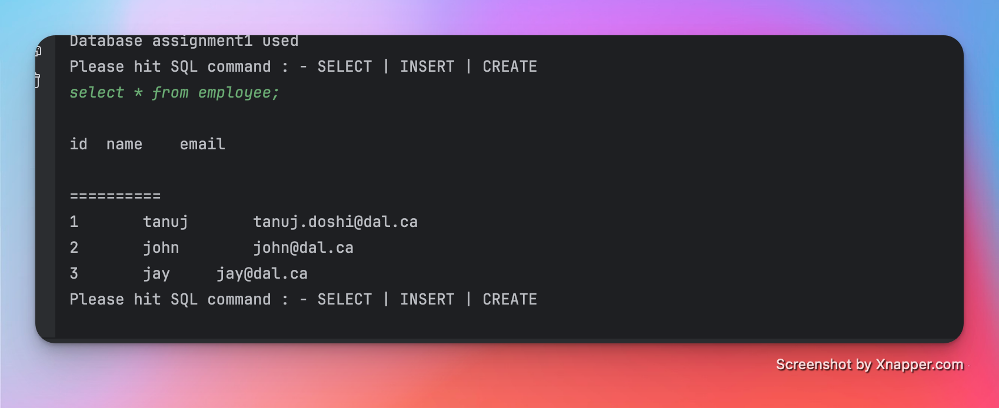

# TinyDB

TinyDb is Prototype of a light-weight DBMS using Java programming language

### Initial Command line interface

- When User first runs our application, the initial CMD looks as shown in below image
- It will ask for users to choose options between they want to register as new user, login as
existing user or exit from the system.

### Registering new user

- Registering new user will ask username , password and captcha
- Captcha is highlighted in red color as shown in below image
- If user enters wrong captcha, system will generate new captcha with 6 letters and ask
user to rewrite and until user does not enter correct captcha it will continue ask that
- Once user has all information correct, it will give congratulations message
  

### Storing user data

- Once the user is registered successfully, the user data is stored in “user.txt”
- As we can see in the image, the password is stored with “md5” hash algorithm
  

### Login user : -

- For login users need to provide user id and password, if that matches with data
stored in file, then the user will be able to access and perform queries in
application.
- Once a user is successfully logged in logs of that user will be added to logs.txt
file.
- If a user enters wrong username or password, it will give “Invalid username or
password”

### Table Queries : -

- Creating table query syntax is same as mysql syntax, here i am creating employee table
with attributes id, name and email

### Insert Queries : -

- Adding some dummy data to employee table

### Selection Queries : -

- For select there are multiple use cases, if user wants all data they can use “*” same as
we are doing in mysql.

